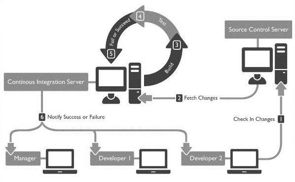
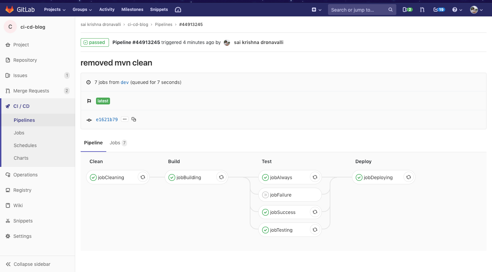
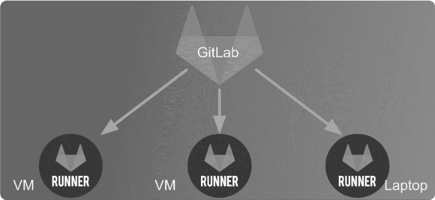

# CI/CD

## Definition



CI/CD, or Continuous Integration/Continuous Deployment, is a software development practice that involves automating the integration of code changes, testing, and deployment processes. It aims to streamline and automate the delivery pipeline, ensuring rapid and reliable software delivery.

**"Continuous integration is a software development practice where members of a team integrate their work frequently... verified by an automated build (including tests) to detect integration errors"**, *Martin fowler*


Integration in the context of CI/CD involves aligning and merging development efforts from various stages (such as development, staging, and production) to ensure that code changes seamlessly transition through these environments, maintaining consistency and reliability.


* **Development Environment**: Developers work on their individual branches, integrating code changes regularly into a shared development branch.
Continuous integration ensures that code changes from multiple developers align and work together in this environment.
* **Staging Environment**: Merged code changes from the development branch are further integrated into a staging branch or environment.
Integration here involves validating code against a staging environment that mirrors the production environment closely.
* **Production Environment**: Once validated in the staging environment, integrated code changes are deployed to the production environment.
Integration in the production environment ensures a smooth transition of tested and validated code to the live system.

## Market overview

| Service             | SCM/SVC (Version Control) | CI                   | CD                   | Issue Tracking       | Issue Boards         |
|---------------------|---------------------------|----------------------|----------------------|----------------------|----------------------|
| [**Git**](https://git-scm.com/)             | ✓                         |                      |                      |                      |                      |
| [**Mercurial (Hg)**](https://www.mercurial-scm.org/)  | ✓                         |                      |                      |                      |                      |
| [**GitLab CI**](https://docs.gitlab.com/ee/ci/)    | ✓                         | ✓                    | ✓                    | ✓                    | ✓                     |
| [**GitHub (Actions)**](https://docs.github.com/en/actions)  | ✓                         | ✓                    | ✓                     | ✓                    | ✓                     |
| [**Bitbucket**](https://bitbucket.org/product/)      | ✓                         | ✓                    | ✓                    | ✓                    | ✓                    |
| [**Gitea**](https://about.gitea.com/)           | ✓                         |  ✓                    | ✓                     |   ✓                   | ✓                     |
| [**Travis CI**](https://www.travis-ci.com/)       |                           | ✓                    | ✓                     |                      |                      |
| [**Jenkin/CloudBees**](https://www.jenkins.io/)         |                           | ✓                    | ✓                    |                      |                      |
| [**CircleCI**](https://circleci.com/)        |                           | ✓                    |✓                      |                      |                      |
| [**Azure DevOps**](https://azure.microsoft.com/fr-fr/products/devops/) |                   | ✓                    | ✓                    |                      |                      |
| [**Google Cloud Build**](https://cloud.google.com/build) |                        | ✓                    | ✓                    |                      |                      |
| [**JetBrain Team City**](https://www.jetbrains.com/teamcity/?utm_source=bing&utm_medium=cpc&utm_campaign=EMEA_en_FR_TeamCity_Branded&utm_term=jetbrains%20teamcity&utm_content=jetbrains%20teamcity) |                        | ✓                    | ✓                    |                      |                      |
| [**Xcode Build**](https://developer.apple.com/documentation/xcode/building-and-running-an-app) |                        | ✓                    | ✓                    |                      |                      |
| [**Bitrise**](https://bitrise.io/) |                        | ✓                    | ✓                    |                      |                      |


## CI/CD Platform (GitLab)

GitLab is a comprehensive DevOps platform that provides integrated CI/CD pipelines alongside version control, issue tracking, and more. It offers robust capabilities for automating software development processes, including building, testing, and deploying applications in a collaborative environment.

Its functionalities include:

- **Version Control:** Robust Git repository management with merge requests, code review, and branching capabilities.
- **CI/CD Pipelines:** Automated build, test, and deployment pipelines for efficient software delivery.
- **Issue Tracking:** Integrated issue tracking system for project management and collaboration.
- **Collaboration Tools:** Wikis, snippets, code analytics, and merge request approvals for streamlined teamwork.
- **Project Management:** Extensive project planning, milestones, boards, and time tracking features.
- **Security Scanning:** Built-in security scanning tools for vulnerability management.
- **Container Registry:** Integrated container registry for storing Docker images.
- **Kubernetes Integration:** Seamless integration with Kubernetes for container orchestration.

### CI/CD features

#### Jobs and stages 



**Jobs:** Individual tasks defined in the `.gitlab-ci.yml` file. They represent actions such as build, test, deploy, etc.
**Stages:** Divisions in the pipeline where jobs are grouped. Typical stages include build, test, deploy, allowing sequential execution.

#### `.gitlab-ci.yml` Configuration

The `.gitlab-ci.yml` is a configuration file at the root of your repository that defines the CI/CD pipeline, specifying jobs, stages, scripts, and configurations for the CI/CD process.

```yaml
# This is an example GitLab CI/CD configuration file

# Define the stages in the pipeline
stages:
  - build
  - test
  - deploy

# Define variables for reuse across jobs
variables:
  ENVIRONMENT: "production"
  APP_NAME: "my-app"

# Jobs definition
build_job:
  stage: build
  script:
    - echo "Building the application..."

test_job:
  stage: test
  script:
    - echo "Running tests..."
  only:
    - master  # Run this job only on the master branch

deploy_job:
  stage: deploy
  script:
    - echo "Deploying to $ENVIRONMENT..."
  environment:
    name: $ENVIRONMENT
    url: https://example.com/my-app
  only:
    - master  # Run this job only on the master branch
```

- `stages`: Defines the stages in the pipeline: build, test, deploy.
- `variables`: Declares variables for reuse across jobs (`ENVIRONMENT`, `APP_NAME`).
- `build_job`, `test_job`, `deploy_job`: Jobs with their respective stages and scripts to execute.
- `only`: Specifies that certain jobs (`test_job`, `deploy_job`) should run only on the `master` branch.
- `environment`: Defines deployment-related information like the environment name and URL for the `deploy_job`.

#### Runner Architecture



- **GitLab Runner:** independant processing power that executes CI/CD jobs defined in the `.gitlab-ci.yml`. It can be installed on various platforms and supports different executor types like Shell, Docker, Kubernetes, etc.
  
- **Executor Types:** Determines how jobs are executed. For instance, Docker executor runs jobs inside Docker containers for isolated and reproducible environments.

### CI/CD for Developers

CI/CD for developers encompasses several key stages:

#### Build

The build stage involves compiling code, running automated builds, and generating artifacts or executable files from the source code.

#### Measure

Metrics and analytics are collected during the CI/CD pipeline to measure the performance and quality of the software being developed.

**Static code analysis** is the process of analyzing code without executing it. It helps identify potential issues, such as code smells, logic errors, and security vulnerabilities.

**A linter** is a tool that analyzes code for potential errors, bugs, stylistic issues, and security vulnerabilities.

**Dynamic code analysis** is the process of analyzing code while it is running. It helps identify potential issues, such as memory leaks, performance bottlenecks, and security vulnerabilities.  


#### Document

Generate automatically the code documentation as your developper kit for newcomers , as SDK documentation for your client...

You can une anotation in your code to generate the documentation with tools like swagger, javadoc. Here is a simple example with javadoc:

```java
/**
 * The Main class is the entry point of the application.
 * It contains the main method that prints "Hello, World!" to the console.
 *
 * @author John Doe
 * @version 1.0
 * @since 2021-10-01
 * @see <a href="https://example.com">Example Website</a>
 */
public class Main {

    /**
     * The main method prints "Hello, World!" to the console.
     *
     * @param args The command-line arguments.
     */
    public static void main(String[] args) {
        System.out.println("Hello, World!");
    }
    
```

#### Test

Automated testing ensures that changes made to the codebase don't introduce bugs or issues. 

There are many types of testing, including : 
* **Unit testing** : test individual components or units of code
* **Integration testing**: test the interaction between different components
* **End-to-end testing** : test the entire application from start to finish
* **UI testing**
   - **Monkey testing** : simulate user interactions randomely
   - **Snapshot testing** : compare the current UI to a previous version
* **Performance testing** : test the performance of the application
* **Security testing** : test the security of the application
* **Functional testing**: test the application from a user perspective without considering the underlying implementation

**Test coverage** is the percentage of code that is executed by the test suite. It is an important metric to measure the quality of the tests and ensure that all code paths are tested.

[Sonarqube](https://www.sonarsource.com/) is a popular tool agregator for code quality ( metrics, bugs, vulnerabilities, code smells and test coverage). It provides a web interface to analyze code changes with dashboards to visualize the history of general quality metrics et and test.

**Sonar scanner** and profiles are a tool that analyze the code and send the result to the sonarqube server.

#### Secure

Unit test your app, make fuctionnal testing, 
Security testing helps identify and address vulnerabilities in the code.

#### Deploy

The deployment phase involves automating the process of releasing applications into production or staging environments.

They are many types of deployments :
* To a **server** or a **cluster** of servers
    - with **basic** tools : scp, rsync, sftp, ftp, ssh
    - Using **provisioning** tools : ansible, chef, puppet, salt, terraform
    - Using container **orchestration tools** : openshift, kubernetes, 
    - Using **virtualization** tools : vmware vcenter, hyper-v, virtualbox, vagrant, 
    - using cloud providers tools (**cli**) : aws, azure, gcp

* To a **Paas platform** apis : heroku, mongo atlas, firebase,
* To a **mobile store** : google play, apple store, amazon app store
* To an **artifact repository** : artifactory, nexus, jfrog, artifactory
* To a **container registry** : docker hub, gihub
* To a **package repository** : npm, maven, nuget, pypi
* To a **configuration repository** : consul, vault, chef, puppet, ansible, terraform
* To a **database** : mysql, postgresql, mongodb,
* To a **message broker** / queue solution : kafka, rabbitmq, activemq, 
* To a **cache** : redis
* To a **search engine** : elasticsearch


## Exercises

### 🧪 Exercice 1 : Build your CI/CD server with docker

Create your gitlab onPremise service. Because gitlab is fully dockerized you are able to create a docker-compose.yml that create your platform locally.

- Create the docker-compose.yml and start your server
    - [https://docs.gitlab.com/ee/install/docker.html#install-gitlab-using-docker-compose](https://docs.gitlab.com/ee/install/docker.html#install-gitlab-using-docker-compose)
- Create a project on the local platform and push some code of your choice

::: details solution

*docker-compose.yml
```yml
*gitlab-ci.yml*
version: '3'
services:
  gitlab-server:
   image: 'gitlab/gitlab-ce:latest'
   hostname: 'localhost'
   ports:
    - '80:80'
    - '22:22'
    - '443:4443'
   environment:
    GITLAB_OMNIBUS_CONFIG: |
      external_url 'http://docker.for.win.localhost'
   restart: always
   volumes:
    - 'gitlab-data:/var/opt/gitlab'
    - 'C:\gitlab-data:/etc/gitlab'
    - 'gitlab-logs:/var/log/gitlab'
volumes:
  gitlab-data:  
  gitlab-logs:
```
:::

::: tip Admin root password
After the service started you can retrieve the initial root password by going to  `/etc/gitlab/initial_root_password` on the gitlab server.
:::

### 🧪 Exercice 2 : Register your laptop PC as a `docker` runner to build your pipelines onPremise

Add a runner that can be the same computer 
    - [https://docs.gitlab.com/runner/install/](https://docs.gitlab.com/runner/install/)
    - [https://docs.gitlab.com/ee/tutorials/create_register_first_runner/index.html](https://docs.gitlab.com/ee/tutorials/create_register_first_runner/index.html)
Configure your pipepline (`gitlab-ci.yml`) with a single stage with an simple echo as script and test that the runner is used.

::: details solution
*add to the previous docker-compose.yml*
```yml
  runner:
   image: 'gitlab/gitlab-runner:latest'
   hostname: 'localhost'
   privileged: true
   environment:
    - DOCKER_HOST=tcp://docker.for.win.localhost:2375
   volumes:    
    - C:\gitlab-runner-data\config:/etc/gitlab-runner
```
:::

### 🧪 Exercise 3 - A full pipeline for a project of your choice on a SaaS CI/CD platform

- Please select a project of your choice (JEE, node, python, android...)
- Push the code to gitlab.com or github.com
- Write a complete pipeline with CI/CD stage and jobs by searching for the right tooling on docker HUB 
-  fill up your gitlab-ci.yml or github actions to have the 6 CI/CD steps automated ( Build, measure, document... cf. the course)

:::details solution

*A solution for a simple JAVA project*
[https://gitlab.com/brah/devops-sample-java](https://gitlab.com/brah/devops-sample-java)
:::

## 📖 Further reading