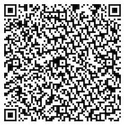
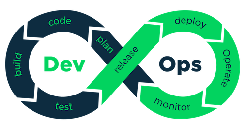
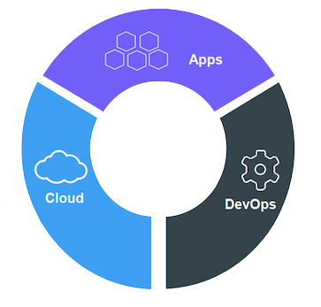
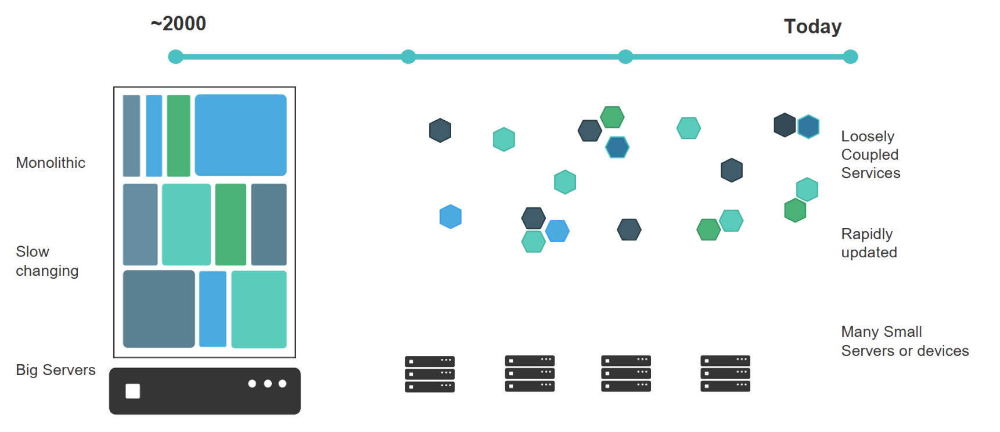
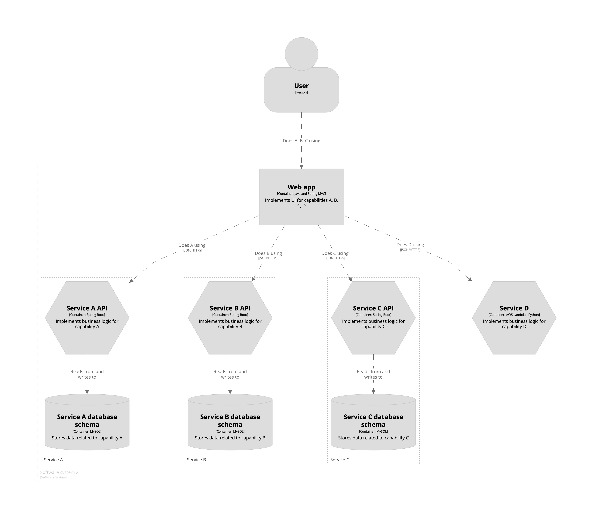
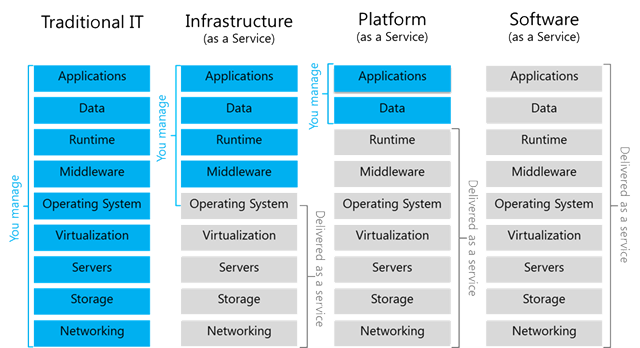
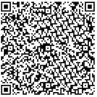

# Let's start 

## Developers and IT Operators ?

Please list missions of Developers and IT operators from [RFI](https://en.wikipedia.org/wiki/Request_for_proposal) / [RFP](https://en.wikipedia.org/wiki/Request_for_information) to the release of an IT service.

[Fill up here](https://awl.li/devops)

## Plan

::: details

- Introduction
    * What is devOps ?
    * Definition
    * A bit of history
    * Architecture

- Role-playing game

- Shell for devOps
    * Linux Filesystem ( tree, rights)
    * Basic commands ( cd,ls, pwd)
    * Package managers ( apt, yum, dnf, pacman)
    * Basic network debug ( ping,ssh, telnet, wget)

- Virtualization
    * Definition
    * HypervisorType II
    * Networks
    * Scripting (VBox Manage)
    * Vagrant
    * HypervisorType I

-  Containerization 
    * Definition
    * Basic usage
    * Images
    * Registries
    * Multi-container with docker compose

-  Orchestration
    * Definition
    * Rancher UI

- Continuous integration/delivery (CI/CD) 
    - Definition
    - Create a containerized CI/CD platform (Gitlab)
    - CI/CD for devs
        * Build
        * Measure
        * Test & Secure
        * Deploy
        * Monitor

- Micro-services
    * Definition
    * Architecture
    * API Gateways

-  Provisionning
    * Ansible
    * Terraform
    * with Vagrant
    * with Gitlab

- Discover the Cloud (Gcloud)
    * VMs ( compute engine)
    * Kubernetes engine
    * Container based ( Cloud run)
    * Serverless
::: 

## Prerequisites

* Network basics (IP, port)
* Shell/Unix scripting skills ( cd, ls, ping, telnet...)
* HTTP Rest server basics ( Apache or Nginx config, Get, Post, Put)
* Virtualization basics (virtualbox or vmware)

## Introduction

Embark on a transformative journey into the world of DevOps with our comprehensive course! 

🚀 Delve into the heart of DevOps methodologies, starting with an immersive exploration of its core principles and the pivotal role it plays in modern software development. 

From mastering virtualization and containerization techniques 📦, creating robust CI/CD pipelines 🛠️, to navigating the intricate landscape of cloud infrastructure with VMs, Kubernetes, Cloud Run, and Serverless technologies ☁️, this course equips you with indispensable skills. 

Uncover the power of provisioning tools like Ansible and Terraform for seamless infrastructure management, while demystifying orchestration with hands-on experience using Rancher UI. 

Engage in practical exercises, real-world case studies, and immersive learning, gaining the technical prowess needed to thrive in the dynamic DevOps landscape. Elevate your expertise and become a proficient DevOps practitioner, ready to drive efficiency, collaboration, and innovation in software development environments! 🌟

### What is DevOps ?

### Definition

 It's **cultural** and **professional movement** that stresses **communication**, **collaboration**, integration, and 
 **automation** to improve the flow of work between **software developers (Dev)**  and **IT operations professionals (Ops)** while 
 automating the process of software delivery and infrastructure changes.
It aims at establishing culture and environment where **building, testing and releasing softwares, can happen rapidly**, frequently and more reliably.”

DevOps is...
* Continuous delivery
* Monitoring
* a person who can perform both Dev and Ops roles
* a team of developers and operation staff
* a movement, a philosophy, a way of thinking
* a culture movement
* means cross skilling people

DevOps is not...
* A Developers managing Production
* All About Automation
* Equals to "Agile“
* a Process, a Methodology, a Framework, a Tool

### Why devOps ?

Here are 4 trends that impulse devOps mouvement.

#### Cloud emergence

The `cloud` refers to a network of remote servers accessed over the internet to store, manage, and process data, providing on-demand computing resources and services without requiring direct local server infrastructure.

#### From monolith to distributed services

A `monolithic application` is a software architecture where all components and functionalities are integrated and interconnected into a single, indivisible unit, typically running as a single process.

ex : A typical example of a Java Enterprise Edition (JEE) application could be an online banking system that uses JEE technologies like Servlets, JavaServer Pages (JSP), Enterprise JavaBeans (EJB), and Java Persistence API (JPA) to handle user authentication, transaction processing, account management, and database interactions within a scalable and secure environment.

a `Distributed architecture` refers to a system design where multiple components or services are deployed across different computers or networks, working together to achieve a common goal. These components communicate and coordinate with each other through networks, enabling scalability, fault tolerance, and efficient resource utilization across various locations.

#### Multi / Micro services architecture

A `multi-services app` typically refers to a software application that integrates or provides access to multiple distinct functionalities, features, or services within a single platform or interface, allowing users to access various services or capabilities without needing separate applications for each function. These apps often offer a range of services like messaging, payments, social networking, and more, catering to diverse user needs within a unified environment.

A `microservices app` is a software architecture that structures an application as a collection of loosely coupled, independently deployable services, each focused on specific business capabilities and communicating through well-defined APIs. These services are typically small, scalable, and can be developed, deployed, and maintained independently, allowing for flexibility, agility, and easier management of complex systems.

#### Continuous delivery / integration

`Continuous Integration (CI)` is a software development practice where developers frequently integrate their code changes into a shared repository. Each integration triggers automated build and test processes to detect errors early.

`Continuous Delivery (CD)` extends CI by automating the delivery process, allowing applications to be deployed to various environments, such as testing, staging, and production, in a consistent and reliable manner. This enables teams to release software updates frequently and reliably, reducing the time between writing code and delivering it to users.

It starting up a tug of war between developpers and Ops :

| Developers     | IT Operations  |
|----------------|----------------|
| Freedom to create and deploy apps fast           | Quickly and fexibly respond to changing needs     |
| Define and package application needs        | Standardize, secure, and manage     |

### A bit of History

The historical roots of cloud computing, traced its emergence back to the 1950s with the inception of mainframe computing and the subsequent development of ARPANET, a precursor to the internet.

Pivotal moments in cloud evolution, include the rise of virtualization in the 1990s, which transformed server utilization, and the introduction of Amazon Web Services (AWS) in the mid-2000s, revolutionizing access to cloud services. It permit to enable key models such as Infrastructure as a Service (IaaS), Platform as a Service (PaaS), and Software as a Service (SaaS) that have shaped the cloud landscape and also pay as you go business model

Another main evolution enabled devops pratices is the evolution of computer containers, starting from their inception. The historical timeline, begin with early Unix days, emphasizing the importance of process isolation to maximize computing resources.

Important milestones such as chroot in 1979, which enabled application isolation, and subsequent advancements like FreeBSD Jails, OpenVZ, Linux-VServer, and the integration of namespaces and cgroups into the Linux kernel will be discussed.  Tools like Warden, Borg at Google, Solaris Containers, and Cloud Foundry, leverage new concepts for application isolation.

Lastly, the groundbreaking introduction of usernamespace into the Linux kernel in 2013, marked the inception of Docker. This influential tool simplifies container creation and management based on Linux kernel functionalities. Through these advancements, a new era in application deployment was ushered in, transforming the landscape of computing.

Join this course to understand and use softwares based on these historical milestones that shaped the creation and efficient management of cloud computing and computer containers, opening doors to innovative approaches in application deployment

### Systems architecture

- **On-Premises:** This refers to the traditional method of hosting and managing computing resources within an organization's physical location or data center. With on-premises infrastructure, all hardware, software, servers, networking equipment, and data storage are maintained and managed by the organization's IT staff.

- **Infrastructure as a Service (IaaS):** IaaS is a cloud computing model that provides virtualized computing resources over the internet. It offers scalable and on-demand resources such as virtual machines, storage, and networking. Users can rent these resources on a pay-as-you-go basis, allowing for flexibility and cost-efficiency without having to manage the physical hardware.

- **Platform as a Service (PaaS):** PaaS is a cloud computing service that provides a platform allowing customers to develop, run, and manage applications without dealing with the underlying infrastructure. It typically includes tools for building, testing, and deploying applications. PaaS offers a framework that simplifies the development process, enabling developers to focus on coding rather than managing hardware or software updates.

- **Software as a Service (SaaS):** SaaS delivers software applications over the internet on a subscription basis. It allows users to access and use software hosted in the cloud without needing to install or maintain it on their devices. Examples of SaaS include email services, customer relationship management (CRM) tools, and productivity software like Google Workspace or Microsoft 365.

These models represent different layers of cloud services, providing varying levels of abstraction from infrastructure to applications, catering to different needs and preferences of businesses and users.

### 🧪 Exercises

To understand the differences between IaaS, PaaS, and SaaS and onpremise by analyze real-world 
Here is a list of application services :

|                           |                           |                           |
|---------------------------|---------------------------|---------------------------|
| Google App Engine         | Atlassian Bitbucket Server| Oracle Cloud              |
| Jenkins                   | Red Hat OpenShift         | Microsoft Azure           |
| Dropbox                   | Alibaba Cloud             | AWS Elastic Beanstalk     |
| Cisco UCS (Unified Computing System) | Docker           | VMware vSphere       |
| IBM Cloud                 | Firebase                  | Salesforce                |
| OpenStack                 | Slack                     | Rackspace                 |
| GitLab                    | Microsoft Office 365      | Gmail                     |
| DigitalOcean              | AWS Elastic Beanstalk     | Microsoft Azure App Service|
| Zoom                      | Zendesk                   | HubSpot                   |
| Google Cloud Platform (GCP)| Microsoft Hyper-V       | AWS                        |
| Heroku                    | GitLab                    |                           |

**Categorize each service or application into one of the three cloud service models (IaaS, PaaS, or SaaS) or as OnPremise service. Justify the categorizations.**

[Fill up here](https://awl.li/architecture)

:::details solutions

IaaS Examples : Offer infrastructure components like virtual machines, storage, and networking resources.
- Amazon Web Services (AWS)
- Microsoft Azure
- Google Cloud Platform (GCP)
- IBM Cloud
- Oracle Cloud
- DigitalOcean: Offers scalable cloud infrastructure with virtual servers.
- Rackspace: Provides cloud services including virtual servers, storage, and networking.
- Alibaba Cloud: Provides IaaS services including computing, storage, and databases.

PaaS Examples : Focus on application development and deployment without managing underlying infrastructure.
- Heroku
- Google App Engine
- Red Hat OpenShift
- AWS Elastic Beanstalk
- Microsoft Azure App Service
- Firebase: Google's mobile and web application development platform.
- Engine Yard: Cloud platform for deploying, managing, and monitoring applications.
- AWS Elastic Beanstalk: Automates deployment, scaling of web applications on AWS.

SaaS Examples: Fully developed software accessible over the internet without maintenance concerns.
- Gmail
- Dropbox
- Salesforce
- Microsoft Office 365
- Slack
- Zoom: Video conferencing software accessible over the internet.
- Zendesk: Cloud-based customer service software.
- HubSpot: Inbound marketing and sales software available via the internet.

On-Premise Solutions:
- VMware vSphere: Offers virtualization solutions for on-premise data centers.
- OpenStack: Facilitates creating and managing cloud infrastructure in-house.
- Docker: Enables containerization and management of applications within on-premise environments.
- Jenkins: On-premise automation server for continuous integration and delivery.
- GitLab: On-premise version control and CI/CD platform.
- Microsoft Hyper-V: On-premise virtualization solution for - Windows servers.
- Cisco UCS (Unified Computing System): In-house computing and networking solution.
- Atlassian Bitbucket Server: On-premise version control repository management.
:::

## 📖 Further reading

